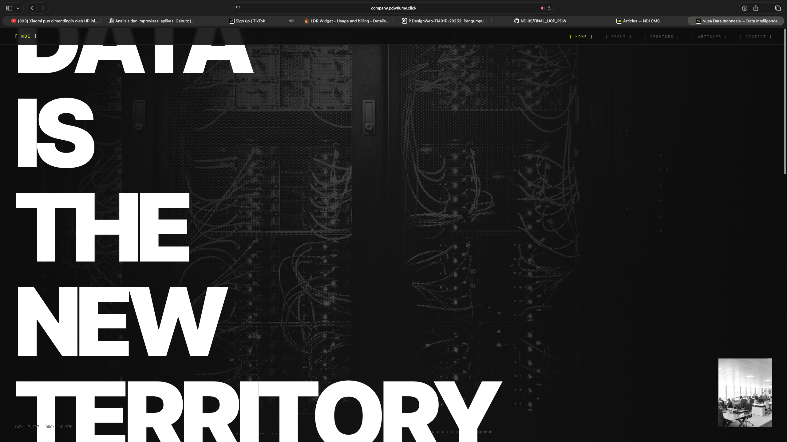
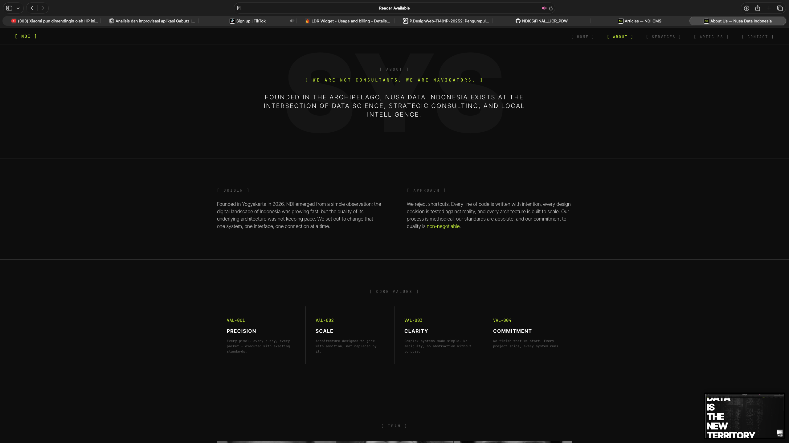
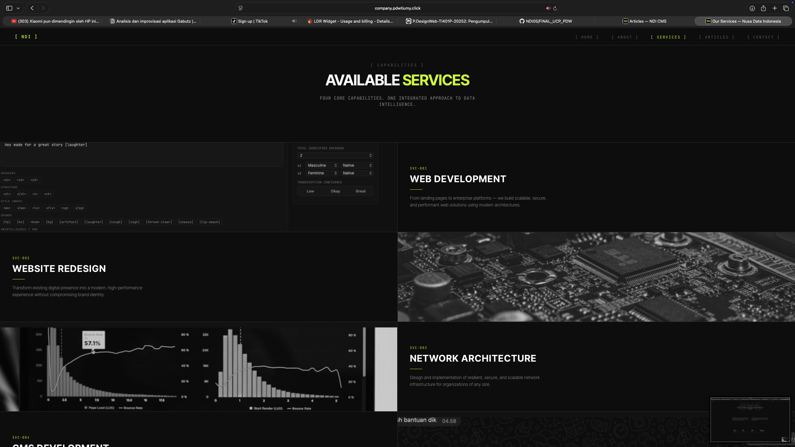
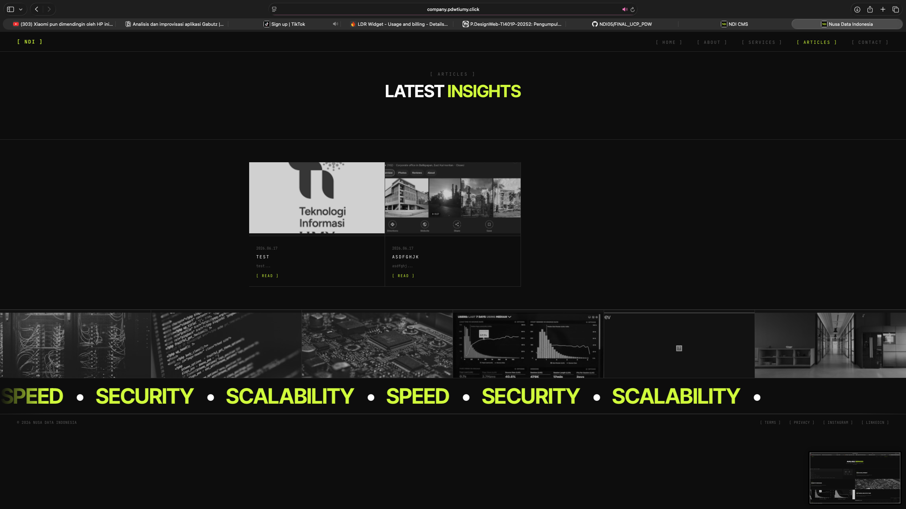
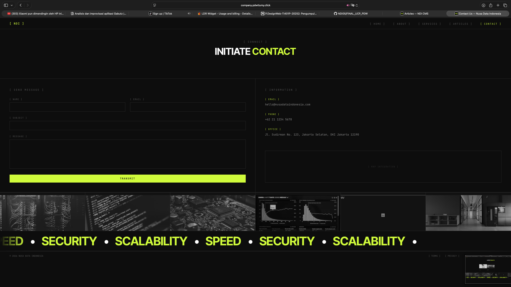
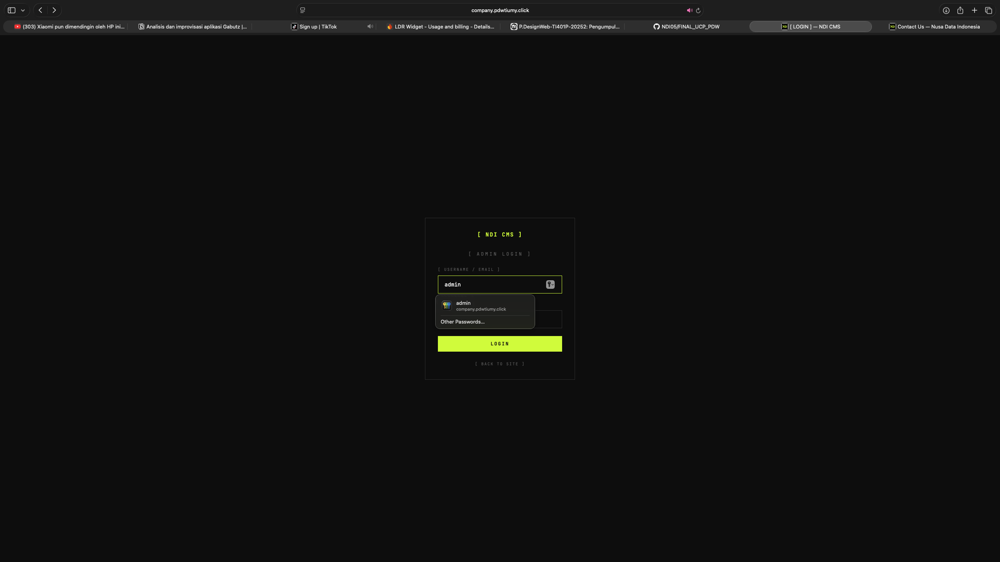
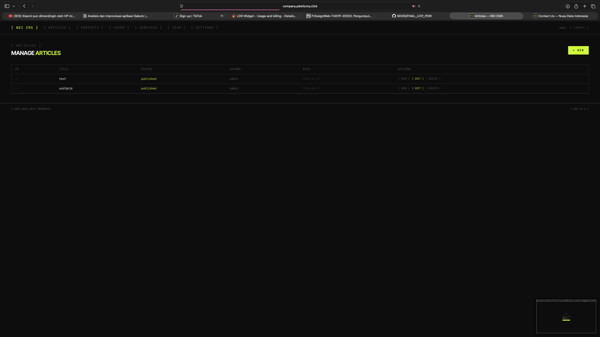

# FINAL UCP PDW - Nusa Data Indonesia (NDI) Portal & CMS

## 1. Deskripsi Singkat Aplikasi
**Nusa Data Indonesia (NDI) Portal & CMS** adalah aplikasi berbasis web yang berfungsi sebagai company profile sekaligus sistem manajemen konten (CMS). Aplikasi ini dibangun dengan Native PHP, Tailwind CSS, dan MySQL. Fitur utama aplikasi ini meliputi:
- Halaman publik informatif (Landing, About, Services, Contact, dan Public Articles).
- CMS untuk manajemen artikel (Create, Read, Update, Delete) beserta upload gambar.
- Sistem autentikasi admin.
- Fitur statistik/tracking pengunjung (Visitor Stats).

## 2. Nama Anggota Kelompok
- **Dhika** (Frontend)
- **Ridha** (Core & Database)
- **Tama** (CMS)
- **Raja** (Public Article Pages & Contact)

## 3. Link Deployment Aplikasi
Aplikasi ini telah di-deploy dan dapat diakses melalui link berikut:
[http://compant.pdwtiumy.click](http://compant.pdwtiumy.click)

## 4. Screenshot Tampilan Antarmuka (UI)

*(Silakan tambahkan file screenshot pada repository ini dan ganti path gambar di bawah dengan path yang sesuai. Contoh: ``)*

### Halaman Publik (Frontend)
1. **Landing Page**
   *(Deskripsi: Halaman utama yang menyambut pengunjung dengan desain atraktif dan animasi interaktif.)*
   

2. **About Us**
   *(Deskripsi: Halaman yang berisi informasi tentang perusahaan Nusa Data Indonesia.)*
   

3. **Services**
   *(Deskripsi: Halaman yang menampilkan layanan yang ditawarkan oleh perusahaan.)*
   

4. **Articles (Public)**
   *(Deskripsi: Halaman yang menampilkan daftar artikel publik dan detail artikel.)*
   

5. **Contact**
   *(Deskripsi: Halaman form kontak yang dapat diisi oleh pengunjung untuk mengirim pesan.)*
   

### Halaman Admin (CMS)
6. **Login Admin**
   *(Deskripsi: Halaman autentikasi untuk masuk ke dalam dashboard admin.)*
   

7. **Dashboard / Manajemen Artikel**
   *(Deskripsi: Halaman bagi admin untuk mengelola artikel (CRUD) dan memonitor data sistem.)*
   


---

## Panduan Deployment cPanel (Dokumentasi Asli)

Dokumen ini berisi panduan langkah demi langkah untuk meng-online-kan website Nusa Data Indonesia ke layanan *hosting* cPanel.

### Persyaratan Sistem (cPanel)
- **PHP Version:** Minimal PHP 8.1 (Disarankan PHP 8.2)
- **Ekstensi PHP:** `mysqli`, `pdo_mysql`, `mbstring`, `fileinfo`, `gd` atau `imagick`
- **Database:** MySQL / MariaDB

### Langkah 1: Upload File ke cPanel
1. Login ke akun cPanel Anda.
2. Masuk ke menu **File Manager**.
3. Navigasi ke dalam folder **`public_html`** (Ini adalah folder utama website Anda).
4. Klik tombol **Upload** di bagian atas, lalu pilih file `NDI_cPanel_Deploy.zip`.
5. Setelah upload selesai (100%), kembali ke File Manager.
6. Klik kanan pada file `NDI_cPanel_Deploy.zip` dan pilih **Extract**.
7. Pastikan seluruh struktur folder (seperti `app/`, `config/`, `public/`) langsung berada di bawah `public_html/`.

*(Opsional: Anda bisa memindahkan isi folder `public/` ke luar ke `public_html/` jika Anda tidak ingin URL memiliki embel-embel `/public`. Namun cara paling aman adalah membiarkan strukturnya, dan melakukan Pointing Domain).*

### Langkah 2: Pembuatan Database MySQL
1. Di cPanel, masuk ke menu **MySQL® Databases**.
2. Buat database baru (misal: `namauser_ndicms`).
3. Scroll ke bawah, buat **MySQL User** baru beserta *password*-nya (ingat baik-baik password ini).
4. Tambahkan User tersebut ke Database yang baru dibuat (Add User To Database).
5. Centang **ALL PRIVILEGES** saat memberikan izin.

### Langkah 3: Impor Tabel Database
1. Buka file `config/database.php` dari File Manager cPanel (Klik kanan -> Edit).
2. Sesuaikan konfigurasi berikut dengan data yang baru Anda buat:
   ```php
   define('DB_HOST', 'localhost');
   define('DB_USER', 'namauser_userdbanda');
   define('DB_PASS', 'password_yang_anda_buat');
   define('DB_NAME', 'namauser_ndicms');
   ```
   Simpan perubahan.
3. Kembali ke cPanel, buka menu **phpMyAdmin**.
4. Di bilah kiri, klik nama database Anda (`namauser_ndicms`).
5. Klik tab **Import** di menu atas.
6. Upload file `database/schema.sql` (atau ekspor dari localhost Anda) lalu klik **Go**.

*(Catatan: Anda juga dapat mengakses file `setup.php` di browser seperti `https://domainanda.com/setup.php` untuk menginisialisasi tabel secara otomatis).*

### Langkah 4: Pengaturan Folder Uploads (Permissions)
Di cPanel, biasanya hak akses otomatis disesuaikan (0755). Namun jika gambar gagal di-upload:
1. Masuk ke File Manager cPanel.
2. Cari folder `public/uploads/`.
3. Klik kanan pada folder tersebut -> **Change Permissions**.
4. Pastikan diset ke `755`. Jika masih gagal, ubah sementara menjadi `777` (meskipun 755 adalah standar teraman di cPanel).

### Langkah 5: Login Admin
- Akses website Anda: `https://domainanda.com/public/admin`
- Default Username: `admin`
- Default Password: `password`

Selesai! Website sudah siap digunakan secara publik.
